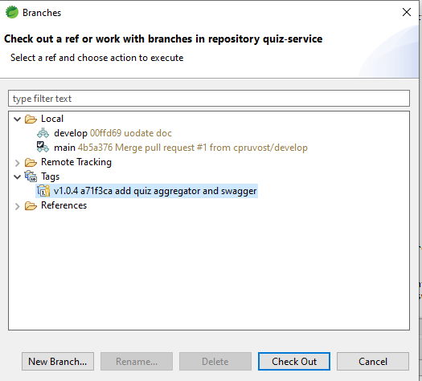

# Quiz Service

This is a SpringBoot sample microservice application that focuses on using Schema Versionning on Oracle Autonomous Database. So the version of the microservice is in a driect relation with the version of the schema in the Database.

## Prerequisites

You need to have a Database  with a schema (tables, views, ..) ready. So use the project [quiz-db](https://github.com/cpruvost/quiz-db) for that. With this project you have a schema in two versions (V1 and V1POINT2).

If you use for ex Oracle SQLDeveloper and if you connect to the database.

execute : alter session set edition=V1; --> The view V_QUIZ has 2 colums

execute : alter session set edition=V1POINT2; --> The view V_QUIZ has 3 colums

You need to be able to run a docker container locally.

You need to have a kubernetes cluster (with istio installed) if you want to deploy these microservices on kube

## Run the microservices application locally.

- in V1 : 
First do a git checkout to get the application version tag v1.0.4

Create a file application-dev.yml from application-prod.yml and replace the credentials of the DataSource with the right values (user, password, url, ALTER SESSION SET EDITION=V1)

Replace "cpruvost" by your docker hub name in the pom.xml file

Build the docker image using Spring Boot

docker run -d -p 8001:8000 yourdockerhubname/cn-quiz-service:1.0.4-SNAPSHOT

In a browser run http://localhost:8001/quizzes and look at the fields of quiz (id, name, and environment)

- in V1.2 :

First do a git checkout to get the application version tag v1.2.0

Then follow exactly the same steps than in V1.

At the end docker run -d -p 8002:8000 yourdockerhubname/cn-quiz-service:1.2.0-SNAPSHOT

In a browser run http://localhost:8002/quizzes and look at the fields of quiz (id, name, and environment + details)

## Run the microservices application in kubernetes.

- Push your docker images to your docker registry (docker hub for ex)
- Update the 2 kube yaml deployment files  (deployment-*.yaml) with the good values
- Create first the Secret datasource-credentials with the right values :
kubectl create secret generic datasource-credentials --from-literal=username=root --from-literal=password=password --from-literal=url=url
- Deploy the 2 yaml files to kube (quiz-service first, istio-rules last)
- check the ip address given by the Load Balancer and in a browser run http://ipaddressLB:8000/quizzes. You should see the microservice V1 because we will see the canary release only if another service (ex quiz-aggregator) calls our quiz-service (you must know well istio to understand that :o)..)

So let's go to the the project [quiz-aggregator](https://github.com/cpruvost/quiz-aggregator-service)

